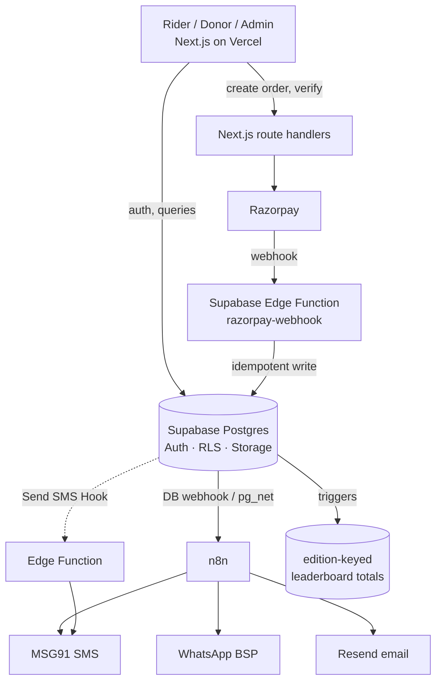

# AJR — Backend Architecture & Build Plan v1.0
*Amar Jawan Ride · drafted Sept 2026. Synthesises the [Site Spec](AJR-Site-Spec.md) with current (2025–26) research on Supabase, Razorpay, India SMS/WhatsApp, and the DPDP Act.*

---

## 1. Executive summary — the recommended stack

| Layer | Choice |
|---|---|
| **Database + Auth + Storage** | **Supabase** (Postgres 17, project `AJR2026`, region **ap-south-1 / Mumbai** — already provisioned, currently empty) |
| **Frontend + app logic** | **Next.js** on **Vercel** (server actions / route handlers for business logic) |
| **Payments** | **Razorpay** — orders + Checkout + webhooks |
| **OTP / SMS** | **Supabase Send SMS Hook → MSG91** (DLT-compliant Indian route) |
| **WhatsApp** | **BSP (AiSensy or Interakt)** — utility templates for approvals/reminders/receipts |
| **Email** | **Resend** (transactional) |
| **Async orchestration** | **n8n** (notifications fan-out, receipts, retries) — off the critical money path |
| **On-site notifications** | Supabase table + Realtime |

**Guiding principle:** one primary backend (Next.js server) + the database enforcing invariants (RLS + triggers) + Edge Functions only for integration endpoints (payment webhook, SMS hook) + n8n for slow/external side-effects. Don't duplicate business logic across all of them.

---

## 2. Auth & identity

- **Supabase Auth**, phone-first per the spec: `signUp({ phone, password })`; email collected into the profile **unverified**; OTP sent via the **Send SMS Hook → MSG91**.
- **Login:** `signInWithPassword` by **phone or email** + password (same user record carries both identifiers).
- **Password reset via OTP:** hand-built — `signInWithOtp({phone})` → `verifyOtp` → `updateUser({password})` (Supabase has no built-in phone-OTP reset).
- **OTP channel = SMS (MSG91)** as the guaranteed path. WhatsApp OTP is an *optional* enhancement only — ~10% of Indian users can't receive WhatsApp, so it can never be the sole channel.
- **DLT/TRAI:** sending any SMS/OTP to Indian numbers legally requires DLT registration (Principal Entity ID, a 6-char header e.g. `AMRJWN`, and pre-registered content templates). ~7–10 business days; MSG91 assists. **This blocks live OTP — start it early** and it needs the legal entity's KYC.

## 3. Data model (core tables)

Grounded in Site Spec §12, refined for RLS and payments. All tables get `id uuid pk default gen_random_uuid()`, `created_at`, and RLS enabled.

**Identity & roles**
- `profiles` (1:1 `auth.users`) — first/second name, email, phone, city_id, onboarding state.
- `rider_profiles` — bike make/model, blood_group *(sensitive — restricted)*, instagram, photo, level/badges.
- `emergency_contacts` — name, relation, phone *(third-party PII — tightly restricted; see §8)*.
- `app_roles(user_id, role)` — global roles: `event_team`, `super_admin`.
- `club_members(user_id, club_id, role)` — role ∈ member/admin.
- `city_hosts(user_id, city_id)`.

**Structure**
- `states` — name, ride_date, theme.
- `cities` — state_id, host, fundraising_target, tier, coordinates *(PostGIS)*.
- `clubs` — name, year_formed, logo, banner, status (pending/approved), admins.
- `club_invitations` — email-keyed link, club_id, status.
- `rides` / `ride_editions` — city_id, venue, route, schedule, capacity, state (draft/live/started/ended). **This is the "edition" the leaderboard filter uses.**

**Money**
- `donors` — name, email, phone, pan *(nullable)* — normalised so repeat donors link.
- `donations` — donor_id, attribution FKs (`rider_id`/`club_id`/`city_id`, all nullable), `ride_edition_id`, `is_anonymous`, `amount_paise`, `currency`, `status` (created→authorized→captured / failed / refunded), `method`, `fee`, `tax`, `razorpay_order_id`, `razorpay_payment_id`, `settlement_id`, timestamps.
- `webhook_events(event_id pk, payload, processed_at)` — idempotency for Razorpay's at-least-once webhooks.

**Ops & compliance**
- `host_applications` — answers q1–q10, status, calendly.
- `orientation_progress` — videos watched, quiz attempts.
- `notifications` — on-site feed (user_id, type, body, read_at).
- `notification_log` — channel, provider, status, for audit/retry.
- `consent_log` — user_id, notice_version, purposes agreed, timestamp *(DPDP)*.
- `leaderboard totals` — see §6.

## 4. Roles & Row Level Security

- **Source of truth = membership tables** (above). **Read path = JWT custom claims** stamped by a **Custom Access Token Auth Hook** (e.g. `user_role`, `admin_club_ids[]`, `host_city_ids[]`) so RLS reads `auth.jwt()` instead of joining on every row.
- **Sensitive/instant-revocation checks** (super_admin, payout approval) → verify live against the table via a `SECURITY DEFINER` helper, *not* the (cacheable, ~1h-stale) JWT claim.
- **Patterns:** public read only on non-PII columns/views (leaderboards, ride pages); owner write via `(select auth.uid()) = user_id` (wrap in sub-select → evaluated once per query, big perf win); admin access via `SECURITY DEFINER STABLE` functions like `is_club_admin(club_id)`.
- **Pitfalls to avoid:** RLS recursion (put role lookups inside `SECURITY DEFINER` functions with `search_path=''`); index every column used in a policy; **enable RLS on every table** and run Supabase's Security Advisor before launch (misconfigured/disabled RLS is the top real-world Supabase breach vector); `service_role` key server-only, never in the browser.

## 5. Payments (Razorpay)

**⚠ Decision to settle first — how "100% to NGOs" works technically:**
- **Model A (recommended to launch):** all funds settle to **AJR's own Razorpay account** (T+2), AJR disburses grants to NGOs off-platform; the intended NGO is recorded per donation in our DB.
- **Model B (Razorpay Route auto-split):** Razorpay settles each NGO's share directly. **Gated** by RBI's Sept-2025 Payment Aggregator rules — Route onboarding for a small nonprofit is not guaranteed; confirm eligibility with Razorpay before relying on it.

**Flow:**
1. `POST /api/orders` (Next.js, server-side) — compute amount **in paise**, create Razorpay Order, store `donations` row `status=created`, put attribution/donor in Order `notes`. Client never dictates the amount.
2. Razorpay **Checkout** (client) → returns order/payment id + signature → `POST /api/verify` → **constant-time HMAC** check (`order_id|payment_id`, KEY_SECRET) → provisional `paid`.
3. **`razorpay-webhook` Supabase Edge Function** = source of truth. Verify the **webhook** signature over the **raw body** (separate WEBHOOK_SECRET, not the key secret); idempotent upsert on `X-Razorpay-Event-Id`; set authoritative status; store `payment_id`, `method`, `fee`, `tax`.
4. On `captured` → trigger a **plain acknowledgement** receipt (see 80G note).
5. Nightly **reconcile** payments ↔ settlements (captured ≠ settled cash; T+2 net of fees).

**Fees:** standard ~**2% + 18% GST**. The ~1.5% NGO rate needs **80G + 12A**, which AJR lacks → budget standard rate, and **decide who absorbs it** given the "100% to NGO" promise (NGO receives net, or add an optional "cover the fee" checkbox for donors).

**80G / tax receipts — important:** AJR has **no 80G**, so **AJR cannot issue tax-deductible receipts and must not imply donations are tax-exempt.** Issue only plain acknowledgements ("thank you for ₹X on <date>, ref <payment_id>"). If a **partner NGO** holds 80G and is the legal donee, that NGO issues the Form 10BE certificate (needs donor name + PAN) — build the data path, but the NGO owns the certificate. Store `donor_pan` (nullable) now to be ready.

## 6. Leaderboards

- **Mechanism:** trigger-maintained **summary tables keyed by edition** — `rider_totals / club_totals / city_totals (entity_id, ride_edition_id, total)`. An `AFTER INSERT/UPDATE/DELETE` trigger on `donations` adjusts them in the same transaction → reads are trivial, genuinely live, scale well past year one.
- **The edition filter** ("all rides, deselect the ones to exclude") becomes a cheap `SUM(...) WHERE ride_edition_id IN/NOT IN (...)` over a handful of pre-aggregated rows — which neither a whole-table materialized view nor per-donation on-the-fly aggregation handles cleanly.
- Expose via a **public SQL view / RPC** returning totals + `display_name = is_anonymous ? 'Anonymous' : name` — never raw donor PII.
- *(On-the-fly indexed aggregation is an acceptable simpler v1 if we want to defer trigger logic; triggers are the target.)*

## 7. Notifications (4 channels)

| Channel | Provider | Use |
|---|---|---|
| WhatsApp | **AiSensy / Interakt** (BSP), utility templates | approvals, ride reminders, receipts |
| SMS | **MSG91** (DLT transactional) | OTP, critical alerts, WhatsApp fallback |
| Email | **Resend** | receipts, digests, updates |
| On-site | Supabase table + Realtime | in-app feed |

**Orchestration:** one **n8n** workflow per event type (`ride_reminder`, `registration_approved`, `donation_received`…). Triggered by a Supabase DB webhook / `pg_net` call; branches on user channel preference; fans out to MSG91 + WhatsApp BSP + Resend + on-site row; logs status to `notification_log` with retry; supports **WhatsApp→SMS fallback**. Money is recorded in Postgres first — n8n only handles side-effects.

## 8. DPDP Act 2023 + Rules 2025 — compliance must-dos

AJR is a **Data Fiduciary** (not a "Significant" one at this scale), full compliance window ~May 2027, but core duties apply now and there's **no small-org exemption**:
1. **Consent** — clear signup notice (what's collected, each purpose, how to withdraw + complain); itemised (separate participation from marketing/photo-posting); **log it** (`consent_log`); withdrawal as easy as giving it.
2. **Minimise** — mark Instagram optional; collect **blood group only for rider safety**, state the purpose, restrict via RLS to city host/event team (never public/leaderboard).
3. **Retention & deletion** — defined schedule; real delete path (hard delete / irreversible anonymisation); notify the user ≥48h before erasing.
4. **Rights** — authenticated "my data / download / delete" screen + published **grievance contact**; support access/correction/erasure/**nomination**.
5. **Security & breach** — encryption (Supabase provides — verify), RLS, audit logs, a breach-notification runbook.
6. **Emergency-contact (third-party) PII** — the sharpest issue: no consent from that person, and DPDP has **no blanket emergency-contact exemption**. Collect the minimum (name/relation/one phone); have the rider **affirm they informed the contact** (record it); RLS-restrict to event team/city host for emergencies only; never market to them; delete with the rider record. **A short review by Indian privacy counsel before launch is advisable** given third-party PII + blood group.

## 9. Hosting, environments & secrets

- **Vercel** (Next.js) + **Supabase Mumbai**. DPDP permits the Mumbai region cleanly (data in-country).
- **Client-exposed:** `NEXT_PUBLIC_SUPABASE_URL`, anon/publishable key only.
- **Server-only (never `NEXT_PUBLIC_`):** service-role key, Razorpay key secret + webhook secret, MSG91/WhatsApp/Resend keys, n8n auth. Store in Vercel env (server scope) and Supabase Edge Function secrets — don't cross-import.
- Separate **Preview vs Production** env sets; ideally a separate staging Supabase project/branch so previews never touch production data.

## 10. External accounts / registrations to start now (long lead times)

1. **Legal entity + bank account** — needed for everything below *(blocks: Razorpay KYC, DLT)*.
2. **Razorpay account + KYC** (entity PAN, registration cert, bank proof).
3. **DLT registration** (PE-ID, `AMRJWN` header, OTP + transactional templates) via MSG91 — ~7–10 days, blocks live OTP.
4. **WhatsApp BSP** (AiSensy/Interakt) + template approval.
5. **Resend** domain verification (SPF/DKIM).
6. **Domain + email** (`amarjawanride.in` + `hello@/safety@/…`).

## 11. Build order (revised from Site Spec §14)

1. **Foundation** — schema + RLS + roles/auth hook; profiles & rider registration (phone OTP + password); "complete your rider card."
2. **Donate** — Razorpay orders/verify/webhook (Model A), donor + donation tables, plain receipts; standalone + rider/club/city attribution + anonymity.
3. **City pages + leaderboards** — edition-keyed totals + triggers, public views.
4. **Clubs** — create/join/invite + approval queue.
5. **Host application + orientation + Ride Admin panel.**
6. **Super-admin portal + comms** (n8n multi-channel), finance/reconciliation exports, DPDP rights screens.

## 12. Decisions

**Locked (Sept 2026):**
1. ✅ **Money flow: Model A** — AJR collects, disburses to partner NGOs off-platform.
2. ✅ **Legal entity: Amar Jawan Ride Events.** No 80G noted → plain acknowledgement receipts, no tax-exempt language (standard ~2% Razorpay rate).
3. ✅ **AJR absorbs the ~2% + GST gateway fee** (NGOs receive the full donated amount).
4. ✅ **Notifications: SMS + email first; WhatsApp later.** Build schema/logic channel-agnostic (`notification_channel` enum already includes whatsapp).

**Still open:**
5. **Contact form** (from the Contact page) — wire to Supabase table or an n8n webhook.
6. **Privacy counsel review** before launch — advisable given third-party emergency-contact data + blood group.
7. **Bank account + Razorpay KYC + DLT registration** — long-lead external setup (see §10), gated on the legal entity.

---

*Next step once decisions 1–4 are directionally set: begin Build Phase 1 (schema + RLS + auth) directly in the `AJR2026` Supabase project via migrations.*
